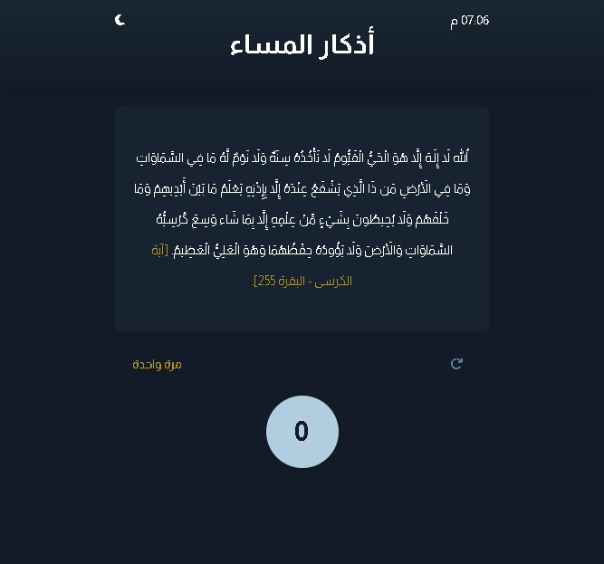

# أذكار الصباح والمساء

Islamic and Arabic App built to practice Vannilla JavaScript, it helps Muslims to do one there daily routine to read a certain Text with a specified repetetion.

## Overview

### The challenge

- the app gets the Time automaticly based on users browser
- if the time is before 03:00 pm the app will show morning Text and if it's after that it will show evening
- users can use the button to count up till there each the specified amount for each text

### Screenshot

### Links

- [Live Site URL](https://husamasaad.github.io/currency-converter/)

## My process

### Built with

- Semantic HTML5 markup
- CSS custom properties
- Flexbox
- Mobile-first workflow
- Vannila JavaScript
- XML Http Request and JSON file

## Author

- github Profile - [Husam Asaad](https://github.com/husamasaad)
